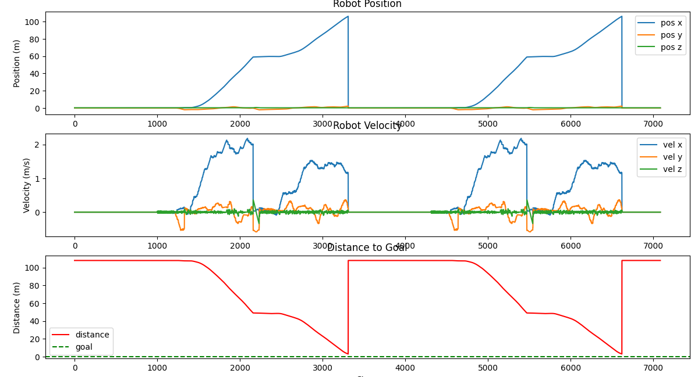
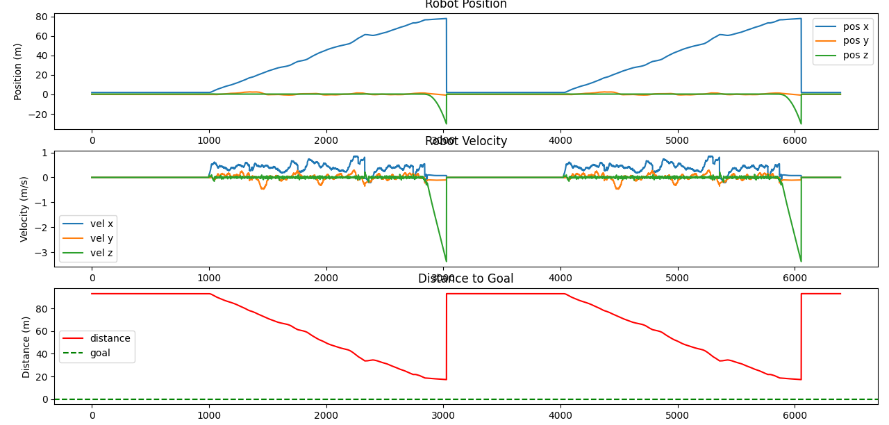

# Robot Corridor Modular - Reinforcement Learning Environment

## Overview
A fully modular, type-hinted, and YAML-configurable RL training environment for robot navigation using MuJoCo physics simulation. Supports curriculum learning with multiple scene types and goal-based navigation.


## Setup Instructions

1. Clone/navigate to project
```bash
git clone https://github.com/nath54/reinforcement_learning_mujoco.git
cd reinforcement_learning_mujoco/
```

2. Create virtual environment (recommended)
```bash
python -m venv .venv
source .venv/bin/activate  # On Windows: .venv\Scripts\activate
```

3. Install dependencies
```bash
pip install -r requirements.txt

# (Optional)
python validate_installation.py  # Verify setup
```

4. Visualize the trained robot
```bash
python -m src.main --play --config config/main_robot_trained.yaml --model_path best_models/best_model.pth
```

---

If you want to train the robot yourself, use the following command:
```bash
python -m src.main --train --config config/main_robot_trained.yaml  # Or any other configs existing in the config directory.
```

It is also possible to train a curriculum pipeline using the following command:
```bash
python -m src.main --pipeline configs_pipelines/curriculum_v2_hd/pipeline.yaml
```

Here are examples of results of a robot trained with the curriculum pipeline `configs_pipelines/curriculum_v2_hd/pipeline.yaml` playing:

- **Stage 04 results :**



As you can see, the robot succesfully navigates through the corridor and reaches the goal.

- **Stage 05 results :**



As you can see, here, the robot didn't reach the goal, but succesfully navigates through a part of the corridor to get closer to the goal before falling off a hole.


## Recent Updates

- **Multi-Scene Support**: New `flat_world` scene type alongside corridor
- **Goal-Based Navigation**: Visual goal markers (red spheres) with distance-based rewards
- **Curriculum Pipeline**: Multi-stage training with progressive difficulty
- **Distance Tracking**: Real-time distance-to-goal display and plotting
- **Code Quality**: Full type hints and docstrings throughout

## Directory Structure

```
├── config/                    # YAML configurations
│   └── main.yaml              # Main config for corridor training
├── configs_pipelines/         # Curriculum pipeline configs
│   └── curriculum_v1/
│       ├── pipeline.yaml      # Pipeline definition
│       ├── stage_01_flat.yaml # Flat world navigation
│       ├── stage_02_obstacles.yaml
│       └── stage_03_corridor_empty.yaml
├── src/
│   ├── core/                  # Types, interfaces, config loading
│   ├── simulation/            # MuJoCo physics, scene generation, sensors
│   ├── environment/           # Gym wrapper, reward strategies
│   ├── models/                # Neural networks (MLP, Transformer)
│   ├── algorithms/            # PPO agent with ActorCritic
│   └── utils/                 # Memory, parallel envs, tracking
├── xml/                       # Robot XML definitions
└── trainings_exp/             # Training outputs (models, logs)
```

## Scene Types

### Corridor (`scene_type: "corridor"`)
- Linear corridor with walls and obstacles
- Goal at end of corridor (beyond obstacles)
- Good for learning forward navigation

### Flat World (`scene_type: "flat_world"`)
- Open arena with boundary walls
- Randomized goal position each episode
- Good for omnidirectional navigation

### Custom XML file (`scene_type: "custom_xml"`)

- Use a custom XML file to define the scene
- For example, the config `config/main_robot_trained.yaml` uses a custom XML file to define the scene here `xml/corridor_3x100_no_full_obstacles.xml`.

## Control Modes

| Mode                 | Actions | Description                    |
| -------------------- | ------- | ------------------------------ |
| `discrete_direction` | 4       | Forward, Backward, Left, Right |
| `continuous_vector`  | 2       | Speed + Rotation               |
| `continuous_wheels`  | 4       | Individual wheel control       |

## Usage

### Training (Single Config)

```bash
python -m src.main --train --config config/main.yaml
```

### Curriculum Training (Pipeline)

```bash
python -m src.main --pipeline configs_pipelines/curriculum_v1/pipeline.yaml
```

### Play with Trained Model

```bash
python -m src.main --play --model_path outputs/best_model.pt --config config/main.yaml
python -m src.main --play --model_path outputs/best_model.pt --live_vision  # With vision overlay
```

### Interactive Keyboard Control

```bash
python -m src.main --interactive --config config/main.yaml
python -m src.main --interactive --config configs_pipelines/curriculum_v1/stage_01_flat.yaml
```

### Controls (Interactive/Play Mode)
- **Arrow Keys**: Move robot
- **1/2/3**: Camera modes (Free/Follow/Top-down)
- **C**: Print camera/robot info
- **S**: Save control history
- **Q/ESC**: Quit

## Configuration

### Scene Configuration

```yaml
simulation:
  scene_type: "flat_world"    # or "corridor"
  corridor_length: 50.0       # Arena size X
  corridor_width: 50.0        # Arena size Y
  goal_radius: 3.0            # Success radius
  randomize_goal: true        # Randomize goal on reset
  obstacles_mode: "none"      # none, random, sinusoidal, double_sinusoidal
```

### Goal Configuration
```yaml
model:
  include_goal: true          # Add goal coords to state vector (4 extra dims)
```

When `include_goal: true`, the state vector includes:
- `dx`: Normalized goal offset X
- `dy`: Normalized goal offset Y
- `distance`: Distance to goal
- `angle`: Angle to goal relative to robot heading

### Reward Configuration

```yaml
rewards:
  goal: 100.0                 # Goal reaching bonus
  velocity_reward_scale: 2.0  # Distance reduction reward scale
  forward_progress_scale: 5.0 # Additional progress bonus
  stuck_penalty: -0.05        # Penalty for being stuck
```

## Reward System

The reward system is **progress-based**, encouraging the agent to move toward the goal while avoiding being stuck:

```
step_reward = (delta_distance * (velocity_reward_scale + forward_progress_scale)) + bonuses_and_penalties
```

Where:
- **`delta_distance`**: `prev_distance - current_distance` (positive when getting closer).
- **`velocity_reward_scale`**: Main multiplier for distance reduction.
- **`forward_progress_scale`**: Additional multiplier for distance reduction (effectively adds to the velocity scale).
- **`bonuses_and_penalties`**:
    - `goal`: A large bonus (**+100.0** or configurable) awarded when reaching the goal radius.
    - `stuck_penalty`: A per-step penalty (**-0.05**) applied if horizontal velocity is below a threshold.
    - `fall_penalty`: A large penalty (**-50.0**) if the robot falls off the arena (triggering termination).

**Note:** The final reward is multiplied by `training.reward_scale` (default 1.0) before being used by the RL algorithm. This works for both **Corridor** and **Flat World** scenes as it always promotes distance reduction to the visual goal.

## Training Features

- Parallel environments (multiprocessing)
- GAE (Generalized Advantage Estimation)
- Gradient clipping
- Entropy regularization
- Action smoothing
- Checkpoint saving (best + latest)
- Curriculum learning with weight transfer

## Dependencies

See `requirements.txt`:

```
pyyaml
numpy
matplotlib
mujoco
gymnasium
opencv-python
torch
tqdm
```

## Key Architecture

1. **Scene Generator** (`simulation/generator.py`): Creates MuJoCo XML with corridor/flat world, obstacles, and goal marker
2. **Environment Wrapper** (`environment/wrapper.py`): Gymnasium interface with goal-based termination
3. **Reward Strategy** (`environment/reward_strategy.py`): Distance-reduction reward
4. **PPO Agent** (`algorithms/ppo.py`): Actor-Critic with CNN vision + state encoder
5. **Tracking** (`utils/tracking.py`): Position, velocity, and distance-to-goal tracking with plotting
